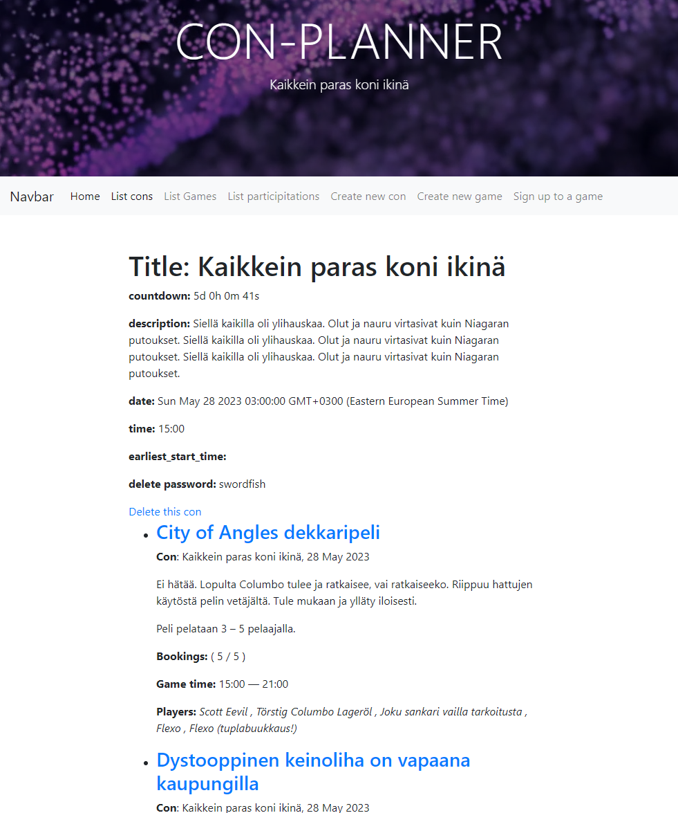

# Con-Planner

* Con-Planner is a web application that allows organizers to let game masters add their games and users to sign up to those games. Maximum number of signups can be set for each game. There can be multiple conventions. 

* The technologies are selected to allow the application to be hosted for free by being under the free tier limits of all it's services.

* Ideally all vendor-locking technologies should be avoided so that it can be easily hosted on the currently free platform. The application should be able to be hosted on any platform that supports NodeJS and MongoDB.

## Entities

1. Convention (Con) - A convention that has multiple games
2. Game - A game that is played at a convention. Game can have multiple signups.
3. Signup - A sign up for a game

## There are no users or accounts

To avoid the need for usser accounts the application uses a resource creation time set delete-password. This password is used to delete the resource. By default the delete-password is swordfish in honor of the really bad movie.

## Avoiding the need to collect user information

Player nicknames are used to sign up to games. This allows the user to avoid giving out their real name or any identifiable information.

## The app uses Atlas Mongo DB

The connection string is set in the environment variable MONGODB_URI. The demosite is hosted by Render.com and uses Atlas Mongo DB from whitelisted Reader addresses.

## Setting up your own Render hosted NodeJS-instance

1. Fork your own repo.
2. Create a new project in Render.com.
3. Create Atlas Mongo DB account.
4. Create a new database in Atlas Mongo DB.
5. Create a new user in Atlas Mongo DB.
6. Whitelist the IP address of your Render.com instance.
7. Set the environment variable MONGODB_URI to the connection string of your Atlas Mongo DB instance.

## Running the app locally

1. Clone the repo.
2. Install the dependencies.
3. Set the environment variable MONGODB_URI to the connection string of your Atlas Mongo DB instance.
4. Run the app with node.

## Issues and todos

* Salt the resource level delete-passwords
* Add tests that cover the main MVP features
* Add Discord bot to notify game masters of signups
* Add Discord bot to notify users of new games
* Add install instructions to more NodeJS / MongoDB free-tier platforms
